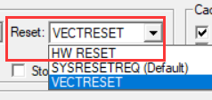
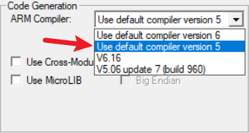
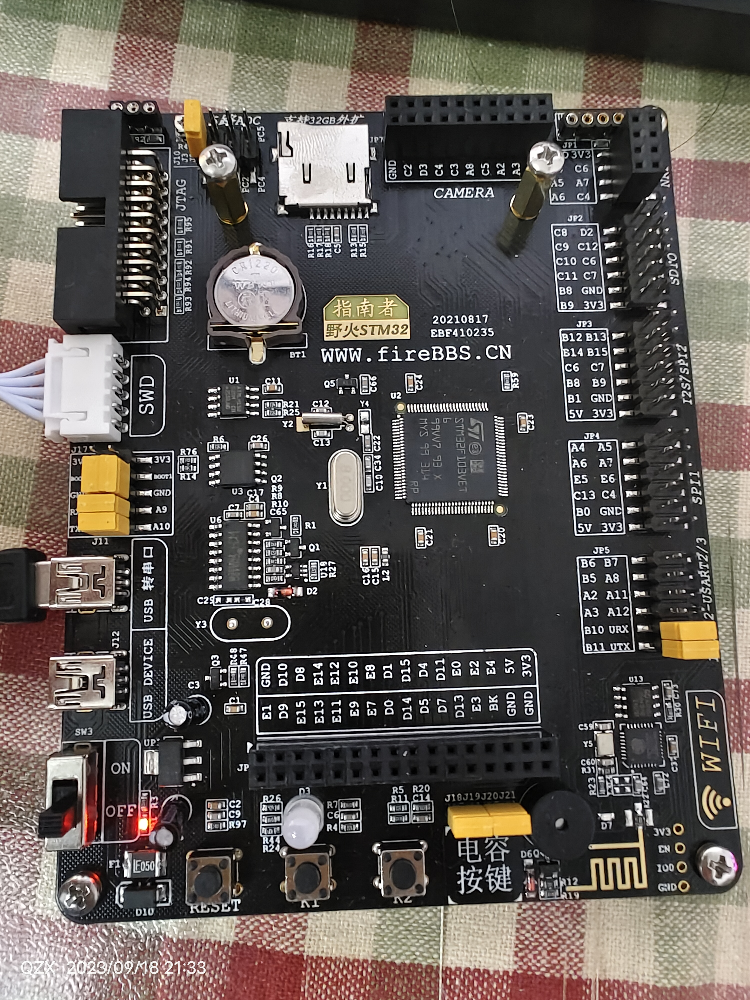

# EmbedFire野火指南者学习🍒

## 目录说明

[src/](./src/) 存放代码的位置

[pdf/](./pdf/) 参考pdf存放位置，包括开发板设计图，stm32F10x参考手册等

[reference/](./reference) 存放代码参考，有官方固件库，还有头文件的参考

## 参考资料

pdf在[项目目录](pdf/)下有

视频参考: [【150集-野火F103霸道/指南者视频教程】入门篇](https://www.bilibili.com/video/BV1Xs411g7Aj?p=7)

## 运行

普通DAP要试debug时，Reset 选择HW RESET

[最新版KEIL error: non-ASM statement in naked function is not supported或者 ‘__STATIC_INLINE‘-CSDN博客](https://blog.csdn.net/weixin_41747032/article/details/125102226)

选用version5编译器(新版本默认version 6)

## 开发板

芯片型号: STM32F103VET6

开发板: [野火STM32指南者](https://doc.embedfire.com/stm32_products/must_read/zh/latest/doc/introduction_of_stm32/STM32/ebf_stm32f103_zhinanzhe/stm32f103_zhinanzhe.html "文档")

开发板图片 :

